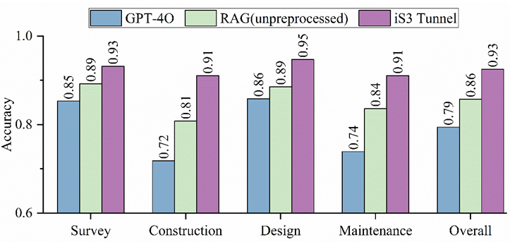

# Tunnel Construction AI Question-Answering Dataset

## Overview

This repository contains a comprehensive dataset for evaluating AI systems' understanding of tunnel construction standards, regulations, and technical knowledge across different construction phases. The dataset is designed to assess the performance of various AI approaches including GPT-4o, traditional RAG (Retrieval-Augmented Generation), and enhanced RAG systems (iS3 Tunnel) in answering domain-specific questions.

## Dataset Structure

The dataset is organized by construction phases/categories, with each subfolder containing multiple AI response formats:

```
results_upload/
├── survey/                         # Geological survey and site investigation
│   ├── gpt-4o_survey.txt          # GPT-4o responses to survey questions
│   ├── rag_raw_survey.txt         # RAG responses using unprocessed standards/documents
│   ├── rag_survey.txt             # RAG responses using processed documents (iS3 Tunnel)
│   └── answers_survey.txt         # Human expert reference answers
├── design/                         # Tunnel design standards and specifications
│   ├── gpt-4o_design.txt          # GPT-4o responses to design questions
│   ├── rag_raw_design.txt         # RAG responses using unprocessed standards/documents
│   ├── rag_design.txt             # RAG responses using processed documents (iS3 Tunnel)
│   └── answers_design.txt         # Human expert reference answers
├── construction/                   # Construction methods and safety protocols
│   ├── gpt-4o_construction.txt    # GPT-4o responses to construction questions
│   ├── rag_raw_construction.txt   # RAG responses using unprocessed standards/documents
│   ├── rag_construction.txt       # RAG responses using processed documents (iS3 Tunnel)
│   └── answers_construction.txt   # Human expert reference answers
├── maintenance/                    # Operation and maintenance procedures
│   ├── gpt-4o_maintenance.txt     # GPT-4o responses to maintenance questions
│   ├── rag_raw_maintenance.txt    # RAG responses using unprocessed standards/documents
│   ├── rag_maintenance.txt        # RAG responses using processed documents (iS3 Tunnel)
│   └── answers_maintenancei.txt   # Human expert reference answers
├── results.png                     # Accuracy comparison chart across categories
└── README.md                       # This file
```

## Categories

The dataset covers four main phases of tunnel construction:

- **Survey**: Geological survey, site investigation, and preliminary assessment (103 questions)
- **Design**: Tunnel design standards, structural calculations, and specifications (114 questions)
- **Construction**: Construction methods, safety protocols, and quality control (79 questions)
- **Maintenance**: Operation and maintenance procedures (135 questions)

## AI Systems Evaluated

### 1. GPT-4o
- Direct question-answering without external knowledge retrieval
- Tests the model's inherent knowledge of tunnel construction standards

### 2. Traditional RAG
- Uses unprocessed regulatory documents and technical literature
- Demonstrates baseline performance with raw document retrieval

### 3. iS3 Tunnel (Enhanced RAG)
- Advanced RAG system with processed and structured knowledge
- Incorporates domain-specific preprocessing and knowledge organization
- Represents state-of-the-art performance in tunnel construction QA

## File Formats

Each answer file contains:
- Question-answer pairs in a structured format
- Confidence scores where applicable
- Source citations for RAG-based responses
- Timestamp information for tracking performance over time

## Usage

This dataset can be used for:

1. **AI System Evaluation**: Compare performance across different AI approaches
2. **Benchmark Development**: Establish baseline metrics for tunnel construction AI
3. **Research**: Study the effectiveness of knowledge processing techniques
4. **Education**: Train and evaluate AI systems for construction domain expertise

## Performance Analysis

The `results.png` file provides a visual comparison of accuracy rates across different AI systems and categories, helping researchers and practitioners understand:

- Which AI approach performs best for each construction phase
- Areas where AI systems need improvement
- The impact of knowledge processing on RAG performance



*Figure: Accuracy comparison across different AI systems and tunnel construction categories*

## Citation

If you use this dataset in your research, please cite:

```
Tunnel Construction AI Question-Answering Dataset
Author: [Liuyang Sheng; Huaiyuan Sun]
Institution: Tongji University
Year: 2025
```

## Contributing

We welcome contributions to expand this dataset:

- Additional questions for existing categories
- New construction phases or specialized topics
- Improved reference answers
- Performance analysis and insights

## Contact

For questions about this dataset, RAG systems, or the tunnel construction question database, please contact:

**Email #1**: 2252056@tongji.edu.cn  
**Email #2**: 2310413@tongji.edu.cn

We are particularly interested in collaborations related to:
- RAG system optimization for construction domains
- Knowledge graph development for engineering standards
- Multi-modal AI applications in construction
- Benchmark development for domain-specific AI evaluation

---

*This dataset is part of ongoing research in AI applications for construction engineering and safety management.* 